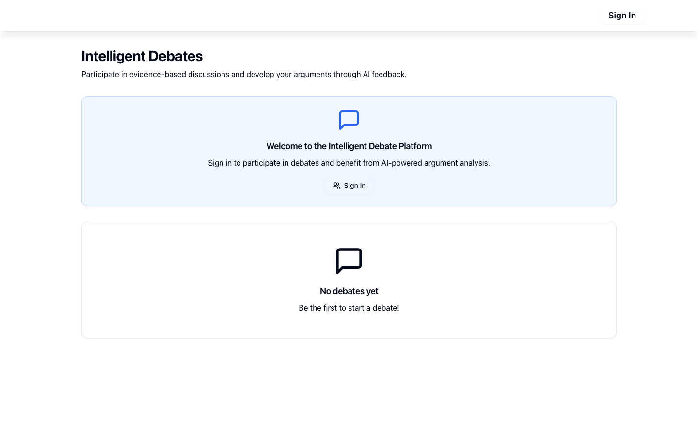

# Debate Wise

[](https://github.com/rockywuest/debate-wise-app/actions/workflows/ci.yml)
[](https://github.com/rockywuest/debate-wise-app/releases)
[](https://github.com/rockywuest/debate-wise-app/blob/main/LICENSE)
[](https://github.com/rockywuest/debate-wise-app/stargazers)



Debate Wise is an AI-assisted debate platform for structured, evidence-based discussion.

The project is now prepared as an **English-first open-source repository** while keeping **German and English in-product language support**.

## Why This Project Exists

Most social platforms optimize for engagement velocity, not reasoning quality. Debate Wise explores a different model:

- structured argument threads instead of flat comment streams
- incentives for argument quality instead of popularity alone
- AI support for fallacy checks, steel-manning, and summaries

## Product Direction (Important)

If this project is shared broadly, requiring every adopter to build a separate community from scratch creates high friction.

A better open-source path is:

1. **Public Commons Mode (recommended default):** one shared, open instance where anyone can participate.
2. **Self-Hosted Space Mode:** organizations can run their own instance for private/curated communities.

This repository now documents both directions so contributors can build features for either mode.

## Who This Is For

- people who want structured debates instead of chaotic comment threads
- educators and communities that want argument quality as a first-class signal
- builders who want an open-source base for public or private debate spaces

## Value in 10 Minutes

1. Start the app locally with your Supabase project.
2. Create a debate and add sample arguments.
3. Review AI-assisted argument analysis and bilingual navigation (EN/DE).

## Start Here

- Contributor guide: `CONTRIBUTING.md`
- Good first issues: `docs/GOOD_FIRST_ISSUES.md`
- Release quality snapshot: `docs/RELEASE_AUDIT_2026-02-22.md`
- Pinned starter issues:
  - [#16 add keyboard shortcuts help dialog](https://github.com/rockywuest/debate-wise-app/issues/16)
  - [#17 improve NotFound route recovery UX](https://github.com/rockywuest/debate-wise-app/issues/17)
  - [#18 add contributor quickstart diagram](https://github.com/rockywuest/debate-wise-app/issues/18)

## Social Preview Asset

- Repository social preview image source: `docs/assets/social-preview.png` (1280x640)
- Recommended: upload this file in GitHub repository settings under social preview.

## Discoverability Keywords

Structured debate platform, AI argument analysis, civic discourse, critical thinking, evidence-based discussion, argument mapping, open-source debate app, bilingual debate software.

## Help This Project Grow

1. Star the repository and watch releases.
2. Open one high-quality issue with reproduction steps or a concrete feature proposal.
3. Pick one item from `docs/GOOD_FIRST_ISSUES.md` and open a focused PR.
4. Share the project with one community (education, civic tech, or moderation tooling).
5. If this project helped you or made you smile, consider buying us a coffee: https://ko-fi.com/rockywuest

## Current Status

- Frontend: React + TypeScript + Vite + Tailwind
- Backend: Supabase (Postgres, Auth, RLS, Realtime, Edge Functions)
- AI functions present for:
  - argument/fallacy analysis
  - steel-man validation
  - thread summarization
- Localization: EN + DE available with English-first defaults
- CI quality gates enabled (`lint`, `typecheck`, `test`, `build`, production `audit`)

## Open-Source Readiness Changes Included

- English-first `README` and repository docs
- Added `LICENSE` (MIT)
- Added `CONTRIBUTING.md`, `CODE_OF_CONDUCT.md`, and `SECURITY.md`
- Added governance and support files (`GOVERNANCE.md`, `MAINTAINERS.md`, `SUPPORT.md`)
- Added RFC process docs (`docs/RFC_PROCESS.md`, `docs/RFC_TEMPLATE.md`)
- Added `.env.example` for self-hosting setup
- Removed hard-coded frontend Supabase instance values in favor of environment variables
- Set English as default UI language fallback

## Tech Stack

- React 18 + TypeScript
- Vite
- Tailwind CSS + shadcn/ui
- React Router
- TanStack Query
- Supabase JS

## Quick Start

### 1. Prerequisites

- Node.js 18+
- npm 9+
- A Supabase project

### 2. Install

```bash
npm run bootstrap
```

### 3. Configure Environment

Create `.env` from the template:

```bash
cp .env.example .env
```

Set values:

```bash
VITE_SUPABASE_URL="https://your-project-ref.supabase.co"
VITE_SUPABASE_PUBLISHABLE_KEY="your-supabase-anon-key"
```

### 4. Run

```bash
npm run dev
```

### 5. Build

```bash
npm run build
```

## Supabase Setup

1. Link your Supabase project.
2. Apply the SQL migrations in `supabase/migrations`.
3. Deploy edge functions in `supabase/functions` if AI features are needed.
4. Set `OPENAI_API_KEY` in Supabase secrets for AI endpoints.

## Scripts

- `npm run dev` - start local dev server
- `npm run bootstrap` - install dependencies and initialize local environment
- `npm run check` - run full local quality gate (lint, typecheck, test, build, audit)
- `npm run check:i18n` - fail on legacy inline EN/DE text helper duplication
- `npm run check:bundle` - enforce JS/CSS bundle budgets on `dist/assets`
- `npm run smoke:routes` - run production-preview smoke checks for critical routes
- `npm run build` - production build
- `npm run build:dev` - development-mode build
- `npm run typecheck` - TypeScript check
- `npm run lint` - ESLint
- `npm run test` - run unit tests (Vitest)
- `npm run test:e2e` - run Playwright end-to-end tests (Chromium)
- `npm run test:watch` - run tests in watch mode
- `npm run audit:prod` - production dependency vulnerability scan
- `npm run preview` - preview production build

## Market Readiness Snapshot (Feb 22, 2026)

- Build pipeline: green (`lint`, `check:i18n`, `typecheck`, `test`, `build`, `check:bundle`, `smoke:routes`, `audit:prod`)
- Test baseline: unit + integration tests plus Playwright E2E smoke flows for auth, debates, and language toggle
- i18n guardrail: consistency check in local/CI quality gates (`check:i18n`)
- Security baseline: no production dependency vulnerabilities in current lockfile
- Security automation: Dependabot + CodeQL + Scorecard workflows configured
- Release automation: release drafter workflow configured
- Maintainer operations: stale issue/PR triage workflow configured
- Performance baseline: route and vendor chunk splitting enabled in Vite build
- Open-source baseline: contribution docs, issue/PR templates, and security policy in place
- Localization baseline: core debate/auth/admin/rating flows support EN/DE with English-first behavior

Detailed launch checklist: see `docs/MARKET_READINESS.md`.
Release audit snapshot: see `docs/RELEASE_AUDIT_2026-02-22.md`.
Architecture and roadmap:
- `docs/ARCHITECTURE.md`
- `docs/adr/README.md`
- `docs/ROADMAP.md`
- `docs/RELEASE_PROCESS.md`
- `docs/SELF_HOSTING.md`
- `docs/PUBLIC_COMMONS_OPERATIONS.md`
- `docs/MONTHLY_UPDATE_TEMPLATE.md`

## Known Gaps (Good First Contributions)

- complete EN/DE translation coverage in less-used legacy component variants
- consolidate remaining duplicated logic across legacy and optimized hooks/components
- expand automated tests beyond current validation coverage (integration/e2e)
- document and implement multi-space tenancy (`space_id`) for public + private deployments
- add observability dashboards and runtime SLO alerts for production deployment

## Repository Conventions

- Repository language: **English**
- UI language support: **English + German**
- New docs, issues, and PR descriptions should be in English

## Governance and Community

- Code of Conduct: see `CODE_OF_CONDUCT.md`
- Contributing: see `CONTRIBUTING.md`
- Governance: see `GOVERNANCE.md`
- Maintainers: see `MAINTAINERS.md`
- Support: see `SUPPORT.md`
- Changelog: see `CHANGELOG.md`
- Contributors: see `CONTRIBUTORS.md`
- Community operations: see `docs/COMMUNITY_PLAYBOOK.md`
- Maintainer runbook: see `docs/MAINTAINER_RUNBOOK.md`
- Security reporting: see `SECURITY.md`
- Security code-scanning status: see `docs/SECURITY_CODE_SCANNING_STATUS.md`

## License

MIT License. See `LICENSE`.
